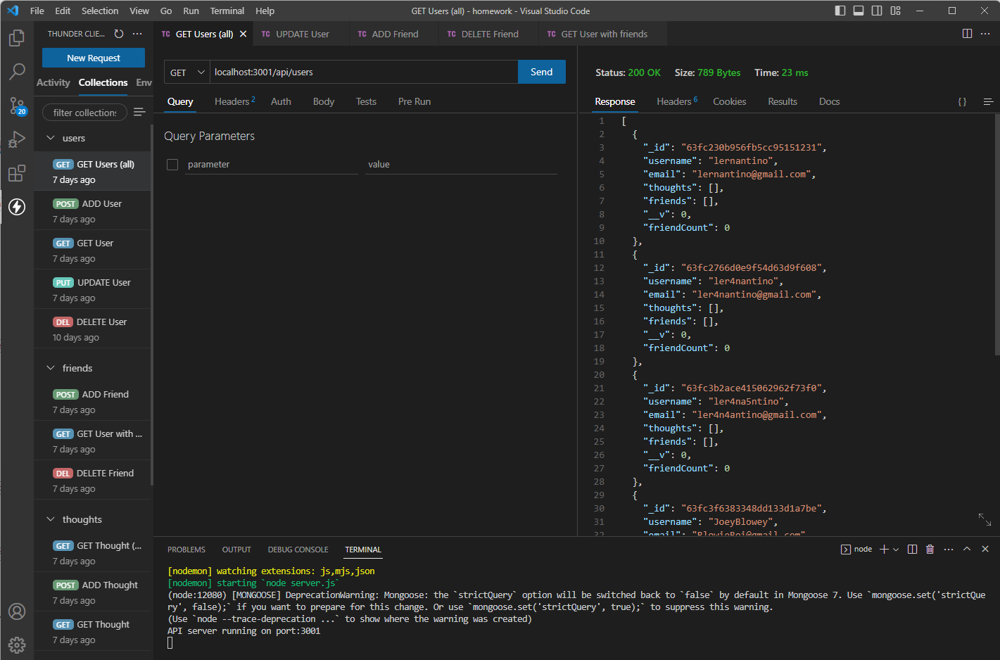
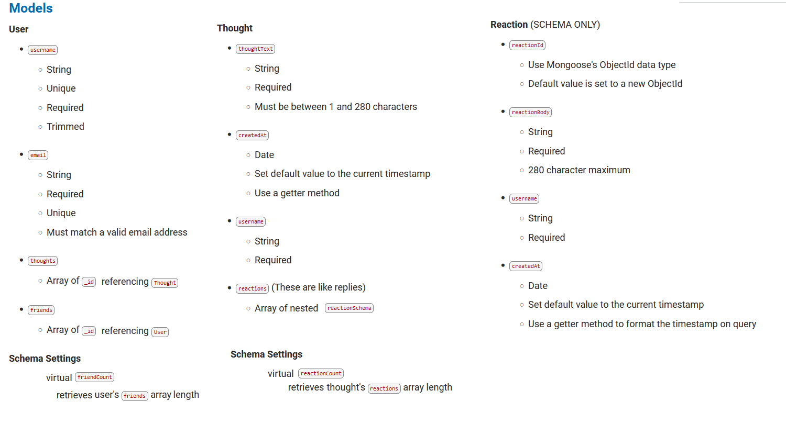

# socialnetwork_api
## Table of Contents
- [Description](#description)
- [User Story](#user-story)
- [Acceptance Criteria](#acceptance-criteria)
- [Table of Contents](#table-of-contents)
- [Installation](#installation)
- [Usage](#usage)
- [Routes](#routes)
- [Tests](#tests)
- [Questions](#questions)


## Description
  
A node.js backend social media application that allows the user to access, change, add, and delete a Mongoose database for 
- Users
- Thoughts
- Friends
- Reactions

 The application contains no front end but provides the models and routes to perform full restfull CRUD operations to the database.


This application uses socialDB.

</br></br></br></br></br>[CLICK HERE -- The file showing full functionality of the application](https://youtu.be/euHRxBOwRr4)  
  


## User Story
  
```
AS A social media startup
I WANT an API for my social network that uses a NoSQL database
SO THAT my website can handle large amounts of unstructured data
```
  

## Acceptance Criteria
  
``` 
GIVEN a social network API
WHEN I enter the command to invoke the application
THEN my server is started and the Mongoose models are synced to the MongoDB database
WHEN I open API GET routes in Insomnia for users and thoughts
THEN the data for each of these routes is displayed in a formatted JSON
WHEN I test API POST, PUT, and DELETE routes in Insomnia
THEN I am able to successfully create, update, and delete users and thoughts in my database
WHEN I test API POST and DELETE routes in Insomnia
THEN I am able to successfully create and delete reactions to thoughts and add and remove friends to a user’s friend list
```


## Installation 
Run the following commands at the project root directory.</br></br>- `npm i` </br>- Run MongoDB Compass </br>- connect: mongodb://127.0.0.1:27017 </br>- npm run start
  

## Usage 
This application uses express, moment, and mongoose packages. If run locally it also uses MongoDb Compass </br> The schema uses socialdb </br>
Run the following commands at the project root directory</br></br>`npm run start`


</br>

## Routes
The following Routes are available to the User:

## GET


```
'./api/users' - Gets All Users
``` 
```
'./api/users/:_id' - Gets One User
``` 
```
'./api/thoughts' - Gets All Thoughts
``` 
```
'./api/thoughts/:_id' - Gets One User
``` 


## POST

```
'./api/users/' - New User
{
  "username": "",
  "email": ""
}
``` 
```
'./api/thoughts/' - New Thought
{
  "thoughtText": "",
  "username": "",
  "userId": ""
}
```
```
'./api/users/:_id/friends/:_id' - New Friend for User
```
```
'./api/thoughts/:_id/reactions' - New Thought
{
  "reactionBody": "",
  "username": ""
}
```


## PUT

```
'./api/users/:_id' - Update User
{
  "username": ""
}
```
```
'./api/thoughts/:_id' - Update Thought
{
  "thoughtText": ""
}
```


## DELETE


```
'./api/users/:_id' - Deletes User
```
```
'./api/users/:_id/friends/:_id' - Deletes Friend From User
```
```
'./api/thoughts/:_id' - Deletes Thought
```
```
'./api/thoughts/:_id/reactions/:_id' - Deletes Reaction From Thought
```


## Tests
No tests included.


## Questions
[Nathan Patnaude](mailto:Nathanpatnaude@gmail.com) , [GitHub Account](https://github.com/Nathanpatnaude)<br />
This Project is on [GitHub](https://github.com/Nathanpatnaude/socialnetwork_api)